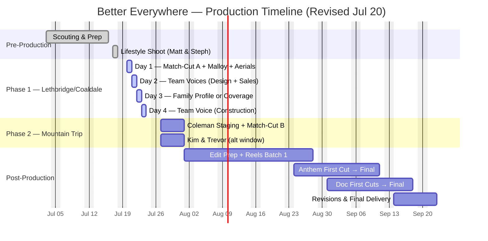

## The Campaign

**Better Everywhere** is built around one idea: Stranville delivers the same standard whether your backyard faces a prairie park or the Rockies. The campaign captures that through three tiers of content, all shot in one production window.

### What We're Producing

| Deliverable | Description |
|-------------|-------------|
| **Brand Anthem** | 60–90 second cinematic film. The Hemsdale match-cut — a seamless transition from the Lethbridge kitchen to the Coleman kitchen, same island, different mountains out the window — is the centrepiece |
| **Documentary Profile 1: The Family** | 2–3 minute film. One real Stranville family in their home, telling their story. Candid, not testimonial |
| **Documentary Profile 2: The Team** | 2–3 minute film. Three Stranville voices — construction, design, and sales — anchored by the same family's experience |
| **Social Library** | 12–15 short-form reels (#BetterMoments), 5–15 seconds each, built from production footage for year-round social rollout across Instagram, Facebook, and TikTok |
| **Community Aerials** | Drone coverage across all key locations — Legacy Park, Malloy Landing, Crowsnest Pass against the Rockies |

### The Match-Cut

The signature moment of the campaign. A camera tracks along a kitchen island. A mug is set down. Cut on motion to the identical island in Coleman — a different hand completes the gesture, mountains visible through the window. Same countertop. Same cabinetry. Different life. Same builder.

Both Hemsdale showhomes share the same floor plan and finishes, which makes the illusion possible. [Match-cut test gallery →](/stranville-living/hemsdale-match-cut-tests/)

---

## Production Schedule — Revised Jul 20

> **⚠️ Schedule update (Jul 20):** Coleman Hemsdale staging is delayed due to a staging team miscommunication. Mountain coverage (match-cut Side B, Coleman interiors, CNP aerials) has been moved to a dedicated mountain trip the **week of July 27**. This week (Jul 20–23) focuses on Lethbridge and Coaldale content only.

### Phase 1 — Lethbridge & Coaldale: Monday July 20 – Thursday July 23

| Day | Focus | Locations |
|-----|-------|-----------|
| **Day 1 — Mon Jul 20** | Match-cut Side A, anthem lifestyle interiors, Malloy Landing, community aerials, framing skeleton shot | BlackWolf Hemsdale, Malloy Landing, Legacy Park, 127 Miners Rd |
| **Day 2 — Tue Jul 21** | Team voices — design + sales interviews | Stranville office / Design Centre / Sales Centre |
| **Day 3 — Wed Jul 22** | Kim & Trevor family profile (if confirmed) or additional Lethbridge coverage | TBC |
| **Day 4 — Thu Jul 23** | Team voice — construction interview on active build site | Construction site TBC |

### Phase 2 — Dedicated Mountain Trip: Week of July 27

| Focus | Locations |
|-------|-----------|
| Match-cut Side B + Coleman hero interiors | Coleman Hemsdale (staged) |
| Second family — Coleman lifestyle | Coleman area couple (local, outdoor lifestyle) |
| Showhome FPV + exteriors | Logan Duplex |
| Construction energy + community activity | Aurora Phase 2 |
| CNP aerials + golden hour | Crowsnest Pass against the Rockies |
| Kim & Trevor family profile (if not completed Jul 22) | Their home |

**Accommodation:** Airbnb in Crowsnest Pass (Sheva arranging). BCMInns was fully booked.

### Documentary Profile 1 — Kim & Trevor

Filming at their home, targeting **Wed Jul 22** (Phase 1) or during the **week of Jul 27** (Phase 2). Pre-interview intro email to be sent — phone calls haven't synced yet.

### Timeline at a Glance

---

## Location Plan

### Lethbridge / Coaldale — Phase 1 (Jul 20–23)

| Location | Use | Status |
|----------|-----|--------|
| **BlackWolf Hemsdale Showhome** (343 BlackWolf Blvd) | Match-cut Side A, anthem lifestyle interiors, FPV sweep | ✅ Furnished showhome |
| **Malloy Landing** (Coaldale) | Showhome interiors, rec facility context, community aerials | ✅ Access confirmed |
| **Legacy Park** | Community establishing shots, aerials, park life | ✅ Public space |
| **127 Miners Rd** | Framing "skeleton" shot — bones of a Hemsdale | ✅ Trusses ready Jul 20. Coordinate with Mike onsite |
| **Stranville Office / Design Centre / Sales Centre** | Design and sales voice interviews (Tue PM) | ✅ Jenna Schmidt + Corissa Mildenberger confirmed |
| **Active construction site** | Construction voice interview (Thu) | ⏳ Scheduling with Brent Hardy |

### Coleman / Crowsnest Pass — Phase 2 (Week of Jul 27)

| Location | Use | Status |
|----------|-----|--------|
| **Coleman Hemsdale** (8619 25th Ave) | Match-cut Side B, hero interiors, deck + mountain shots | ⚠️ Staging delayed — Sheva's team coordinating |
| **Logan Duplex Showhome** (8633–8677 24th Ave) | Furnished showhome coverage, FPV sweep | ✅ Near complete, furnished |
| **Aurora Phase 2** | Construction energy, community activity | ✅ Active site |
| **Crowsnest Pass aerials** | Community establishing, golden hour against the Rockies | ✅ Public airspace |

> **Note:** 72 Kananaskis Wilds (Maycroft) has sold — new owners moved in. The Coleman Hemsdale and Logan Duplex absorb its hero coverage role. A local Coleman couple (outdoor lifestyle, two dogs) is being considered for the second-family match-cut role. See [Coleman scouting footage →](/stranville-living/coleman-scout-jul3/)

---

## Coleman Hemsdale Staging

The Coleman Hemsdale is complete but unfurnished. Since it's now our primary mountain hero property — covering both the match-cut and the aspirational interior shots — staging is essential.

**Timeline:** Staging team is coordinating for the week of Jul 27. Sheva's staging/design team has the shot list and zone requirements.

### What We Need Staged

| Area | Priority | Items Needed |
|------|----------|-------------|
| **Kitchen island** | 🔴 Critical | 2 bar stools, clean countertops. We bring matched mug pair + food styling props |
| **Deck** | 🟡 High | Clean and accessible. Patio chair or small bistro set if available |
| **Living room** | 🟡 High | Sofa or armchair, side table, throw blanket |
| **Dining area** | 🟠 Medium | Table with simple place settings or centerpiece |
| **Primary bedroom** | 🟠 Medium | Made bed with clean linens, nightstand |
| **Architecture details** | 🟢 Low | Works unstaged, but staging improves finish shots |

---

## Construction Site Access

**Site contacts:**
- **Joel Spanos** — 403-634-9475
- **Brent Hardy** — 403-330-9977

Please call or text before visiting any active site. They coordinate with trades and need 24 hours' notice.

**Framing shot at 127 Miners Rd:** Roof trusses ready by July 20. Talk to Mike onsite. This captures the "bones of a Hemsdale" — the same structure as the finished homes, at the framing stage.

**PPE required** at all active construction sites.

---

## Team Voices — Confirmed

| Role | Name | Shoot Day | Location |
|------|------|-----------|----------|
| **Design** | Jenna Schmidt | Tue Jul 21 PM | Stranville office / Design Centre |
| **Sales** | Corissa Mildenberger | Tue Jul 21 PM | Stranville office / Sales Centre |
| **Construction** | Brent Hardy | Thu Jul 23 | Active construction site |

All three have been briefed by Sheva on the Kim & Trevor throughline. Michael is sending individual briefs with sample questions.

---

## What We Need from Stranville

| Item | Status | Details |
|------|--------|---------|
| Coleman Hemsdale staging | ⏳ Week of Jul 27 | Staging team coordinating. Shot list sent |
| Coleman second family | ⏳ Casting | Local couple (outdoor lifestyle, two dogs). Michael reached out |
| CNP filming family | ⏳ Searching | Sheva checking past clients; Michael also looking |
| Airbnb accommodation | ⏳ Sheva arranging | For crew during week of Jul 27 mountain trip |
| Malloy Landing showhome access | ✅ Confirmed | Address + access confirmed |
| Design Centre / Sales Centre | ✅ Confirmed | Tue Jul 21 PM |
| Kim & Trevor schedule | ⏳ Coordinating | Intro email to be sent. Wed Jul 22 or week of Jul 27 |

---

## Post-Production Timeline

| Deliverable | Target |
|------------|--------|
| First social reels batch (6–8) | ~Aug 20 |
| Brand anthem first cut | ~Aug 24 |
| Documentary first cuts | ~Aug 31 |
| Anthem final approved | Mid-September |
| Full package delivery | Late September |

Two revision rounds per deliverable. Feedback within 10 business days per cut keeps the timeline on track.

---

## Recent Updates

➡️ [Abitibi Road Scout — Jul 13](/stranville-living/abitibi-scout-jul13/) — Interior walk-through of 1255 Abitibi Rd (framing/rough-ins)

➡️ [Hemsdale Match-Cut Tests](/stranville-living/hemsdale-match-cut-tests/) — Jul 9 test gallery exploring angles, lighting, and material variations

➡️ [Malloy Landing — Aerial Scout](/stranville-living/malloy-landing-scout-jul7/) — Jul 7–8 drone coverage of subdivision and rec centre

➡️ [Coleman Scouting Trip](/stranville-living/coleman-scout-jul3/) — Jul 3 anamorphic test footage and aerials from four Coleman properties

---

*Questions? Contact **michael@coalbanks.com** or reach out through Sheva.*
