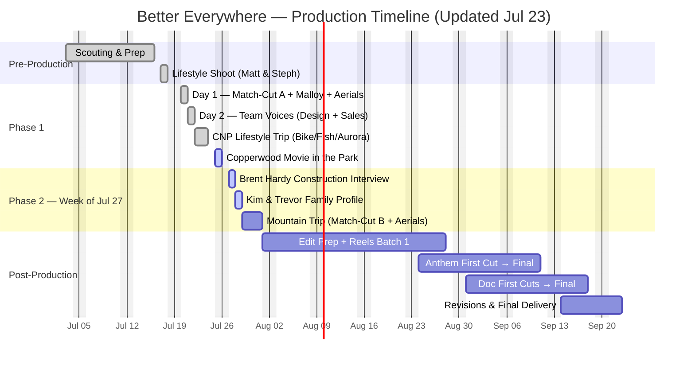

## The Campaign

**Better Everywhere** is built around one idea: Stranville delivers the same standard whether your backyard faces a prairie park or the Rockies. The campaign captures that through three tiers of content, all shot in one production window.

### What We're Producing

| Deliverable | Description |
|-------------|-------------|
| **Brand Anthem** | 60–90 second cinematic film. The Hemsdale match-cut — a seamless transition from the Lethbridge kitchen to the Coleman kitchen, same island, different mountains out the window — is the centrepiece |
| **Documentary Profile 1: The Family** | 2–3 minute film. One real Stranville family in their home, telling their story. Candid, not testimonial |
| **Documentary Profile 2: The Team** | 2–3 minute film. Three Stranville voices — construction, design, and sales — anchored by the same family's experience |
| **Social Library** | 12–15 short-form reels (#BetterMoments), 5–15 seconds each, built from production footage for year-round social rollout across Instagram, Facebook, and TikTok |
| **Community Aerials** | Drone coverage across all key locations — Legacy Park, Malloy Landing, Crowsnest Pass against the Rockies |

### The Match-Cut

The signature moment of the campaign. A camera tracks along a kitchen island. A mug is set down. Cut on motion to the identical island in Coleman — a different hand completes the gesture, mountains visible through the window. Same countertop. Same cabinetry. Different life. Same builder.

Both Hemsdale showhomes share the same floor plan and finishes, which makes the illusion possible. [Match-cut test gallery →](/stranville-living/hemsdale-match-cut-tests/)

---

## Production Schedule — Updated Jul 23

> **Schedule evolution:** Coleman Hemsdale staging was delayed on Jul 16, moving the main mountain coverage to a dedicated trip the **week of July 27**. Staging completed **Jul 22**. A small crew also made an early CNP trip Jul 22–23 for mountain lifestyle coverage, and a Copperwood community event was added Jul 25.

### Phase 1 — Lethbridge & Coaldale + Early Mountain Coverage: Jul 20–25

| Day | Focus | Locations | Status |
|-----|-------|-----------|--------|
| **Mon Jul 20** | Match-cut Side A, anthem lifestyle interiors, Malloy Landing, community aerials, framing skeleton shot | BlackWolf Hemsdale, Malloy Landing, Legacy Park, 127 Miners Rd | ✅ Complete |
| **Tue Jul 21** | Team voices — design + sales interviews | Stranville office / Design Centre / Sales Centre | ✅ Complete |
| **Wed–Thu Jul 22–23** | Early mountain trip: FPV mountain biking, fly fishing, Aurora construction activity, Hemsdale exteriors | Crowsnest Pass / Coleman | ✅ Complete |
| **Fri Jul 24** | Production prep, gear turnaround, media offload | Lethbridge | ⏳ Scheduled |
| **Sat Jul 25** | **NEW:** Copperwood "Movie in the Park" community event — Stranville booth, community engagement B-roll | Copperwood. Festivities 3:00 PM, movie 7:00 PM | ⏳ Scheduled |

### Phase 2 — Week of July 27

| Day | Focus | Locations |
|-----|-------|-----------|
| **Mon Jul 27, 11:00 AM** | Construction voice — Brent Hardy interview, branded vehicle + site-to-site driving coverage | Stranville office, then active site |
| **Tue Jul 28, 9:00 AM** | Kim & Trevor family documentary ✅ confirmed | Their home, Copperwood |
| **Wed–Fri (approx.)** | Mountain trip: match-cut Side B + Coleman hero interiors, Logan Duplex FPV + exteriors, CNP aerials + golden hour | Coleman / Crowsnest Pass |

**Accommodation:** Airbnb in Crowsnest Pass for crew of four (Sheva arranging; exact nights confirming). BCMInns was fully booked.

### Documentary Profile 1 — Kim & Trevor

**Confirmed: Tuesday, July 28, 9:00 AM** at their Copperwood home. One hour of setup, conversational interview, candid cutaways — about three hours total with a small crew.

### Timeline at a Glance

---

## Location Plan

### Lethbridge / Coaldale — Phase 1 (Jul 20–23)

| Location | Use | Status |
|----------|-----|--------|
| **BlackWolf Hemsdale Showhome** (343 BlackWolf Blvd) | Match-cut Side A, anthem lifestyle interiors, FPV sweep | ✅ Furnished showhome |
| **Malloy Landing** (Coaldale) | Showhome interiors, rec facility context, community aerials | ✅ Access confirmed |
| **Legacy Park** | Community establishing shots, aerials, park life | ✅ Public space |
| **127 Miners Rd** | Framing "skeleton" shot — bones of a Hemsdale | ✅ Trusses ready Jul 20. Coordinate with Mike onsite |
| **Stranville Office / Design Centre / Sales Centre** | Design and sales voice interviews | ✅ Filmed Jul 21 |
| **Active construction site** | Construction voice interview (Mon Jul 27, 11 AM — office start) | ✅ Brent Hardy confirmed |

### Coleman / Crowsnest Pass — Phase 2 (Week of Jul 27)

| Location | Use | Status |
|----------|-----|--------|
| **Coleman Hemsdale** (8619 25th Ave) | Match-cut Side B, hero interiors, deck + mountain shots | ✅ Staging complete (Jul 22) |
| **Logan Duplex Showhome** (8633–8677 24th Ave) | Furnished showhome coverage, FPV sweep | ✅ Near complete, furnished |
| **Aurora Phase 2** | Construction energy, community activity | ✅ Active site |
| **Crowsnest Pass aerials** | Community establishing, golden hour against the Rockies | ✅ Public airspace |

> **Note:** 72 Kananaskis Wilds (Maycroft) has sold — new owners moved in. The Coleman Hemsdale and Logan Duplex absorb its hero coverage role. The second-family lifestyle role is filled: Mike Miechkota filmed mountain biking and fly fishing content Jul 22–23, including at a Stranville home in Aurora. See [Coleman scouting footage →](/stranville-living/coleman-scout-jul3/)

---

## Coleman Hemsdale Staging

The Coleman Hemsdale is complete but unfurnished. Since it's now our primary mountain hero property — covering both the match-cut and the aspirational interior shots — staging is essential.

**Timeline:** ✅ Staging complete as of end of day Jul 22. The home is ready for match-cut Side B during the mountain trip.

### What We Need Staged

| Area | Priority | Items Needed |
|------|----------|-------------|
| **Kitchen island** | 🔴 Critical | 2 bar stools, clean countertops. We bring matched mug pair + food styling props |
| **Deck** | 🟡 High | Clean and accessible. Patio chair or small bistro set if available |
| **Living room** | 🟡 High | Sofa or armchair, side table, throw blanket |
| **Dining area** | 🟠 Medium | Table with simple place settings or centerpiece |
| **Primary bedroom** | 🟠 Medium | Made bed with clean linens, nightstand |
| **Architecture details** | 🟢 Low | Works unstaged, but staging improves finish shots |

---

## Construction Site Access

**Site contacts:**
- **Joel Spanos** — 403-634-9475
- **Brent Hardy** — 403-330-9977

Please call or text before visiting any active site. They coordinate with trades and need 24 hours' notice.

**Framing shot at 127 Miners Rd:** Roof trusses ready by July 20. Talk to Mike onsite. This captures the "bones of a Hemsdale" — the same structure as the finished homes, at the framing stage.

**PPE required** at all active construction sites.

---

## Team Voices

| Role | Name | Shoot Day | Status |
|------|------|-----------|--------|
| **Design** | Jenna Schmidt | Tue Jul 21, Stranville office / Design Centre | ✅ Filmed |
| **Sales** | Corissa Mildenberger | Tue Jul 21, Sales Centre | ✅ Filmed |
| **Construction** | Brent Hardy | Mon Jul 27, 11:00 AM — office start, then on-site | ⏳ Confirmed |

All three were briefed on the Kim & Trevor throughline ahead of their sessions.

---

## What We Need from Stranville

| Item | Status | Details |
|------|--------|---------|
| Coleman Hemsdale staging | ✅ Complete Jul 22 | Home ready for match-cut Side B |
| Coleman second family | ✅ Booked + filmed | Mike Miechkota — biking + fly fishing coverage Jul 22–23, incl. at a Stranville home in Aurora |
| CNP filming family | ⏳ Searching | Sheva checking past clients and local contacts (Danielle R. has a possible candidate) |
| Airbnb accommodation | ⏳ Sheva arranging | Crew of four, week of Jul 27; exact nights confirming |
| Malloy Landing showhome access | ✅ Confirmed | Address + access confirmed |
| Design Centre / Sales Centre | ✅ Complete | Interviews filmed Jul 21 |
| Kim & Trevor schedule | ✅ Confirmed | Tue Jul 28, 9:00 AM at their Copperwood home |

---

## Post-Production Timeline

| Deliverable | Target |
|------------|--------|
| First social reels batch (6–8) | ~Aug 20 |
| Brand anthem first cut | ~Aug 24 |
| Documentary first cuts | ~Aug 31 |
| Anthem final approved | Mid-September |
| Full package delivery | Late September |

Two revision rounds per deliverable. Feedback within 10 business days per cut keeps the timeline on track.

---

## Recent Updates

➡️ [Production Week Update (Jul 22)](/stranville-living/production-update-jul22/) — Team voices complete, mountain lifestyle coverage underway, Copperwood community event added

➡️ [Abitibi Road Scout — Jul 13](/stranville-living/abitibi-scout-jul13/) — Interior walk-through of 1255 Abitibi Rd (framing/rough-ins)

➡️ [Hemsdale Match-Cut Tests](/stranville-living/hemsdale-match-cut-tests/) — Jul 9 test gallery exploring angles, lighting, and material variations

➡️ [Malloy Landing — Aerial Scout](/stranville-living/malloy-landing-scout-jul7/) — Jul 7–8 drone coverage of subdivision and rec centre

➡️ [Coleman Scouting Trip](/stranville-living/coleman-scout-jul3/) — Jul 3 anamorphic test footage and aerials from four Coleman properties

---

*Questions? Contact **michael@coalbanks.com** or reach out through Sheva.*
